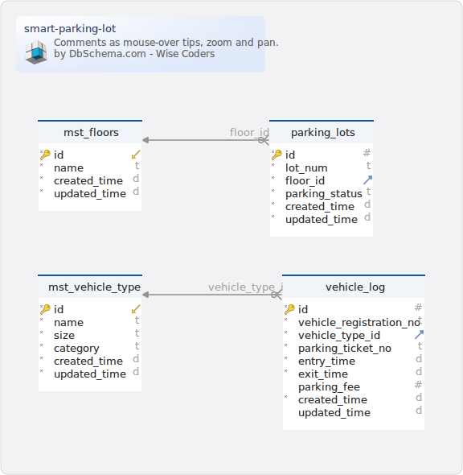

#smart-parking-lot
Generated using [DbSchema](https://dbschema.com)

### smart-parking-lot

## Tables

1. [smart-parking-lot.mst_floors](#table%20smart-parking-lot.mst\_floors) 
2. [smart-parking-lot.mst_vehicle_type](#table%20smart-parking-lot.mst\_vehicle\_type) 
3. [smart-parking-lot.parking_lots](#table%20smart-parking-lot.parking\_lots) 
4. [smart-parking-lot.vehicle_log](#table%20smart-parking-lot.vehicle\_log) 

### Table smart-parking-lot.mst_floors 
|Idx |Name |Data Type |
|---|---|---|
| * &#128273;  &#11019; | id| INT AUTO_INCREMENT |
| * | name| VARCHAR(100)  |
| * | created\_time| DATETIME  |
| * | updated\_time| DATETIME  |

##### Indexes 
|Type |Name |On |
|---|---|---|
| &#128273;  | pk\_mst\_floors | ON id|

##### Options 
engine=InnoDB 

### Table smart-parking-lot.mst_vehicle_type 
|Idx |Name |Data Type |
|---|---|---|
| * &#128273;  &#11019; | id| INT AUTO_INCREMENT |
| * | name| VARCHAR(100)  |
| * | size| VARCHAR(100)  |
| * | category| VARCHAR(50)  |
| * | created\_time| DATETIME  |
| * | updated\_time| DATETIME  |

##### Indexes 
|Type |Name |On |
|---|---|---|
| &#128273;  | pk\_mst\_vehicle\_type | ON id|

##### Options 
engine=InnoDB 

### Table smart-parking-lot.parking_lots 
|Idx |Name |Data Type |
|---|---|---|
| * &#128273;  | id| INT AUTO_INCREMENT |
| * | lot\_num| VARCHAR(100)  |
| * &#11016; | floor\_id| INT  |
| * | parking\_status| VARCHAR(100)  |
| * | created\_time| DATETIME  |
| * | updated\_time| DATETIME  |

##### Indexes 
|Type |Name |On |
|---|---|---|
| &#128273;  | pk\_parking\_lots | ON id|

##### Foreign Keys
|Type |Name |On |
|---|---|---|
|  | fk_parking_lots_mst_floors | ( floor\_id ) ref [smart-parking-lot.mst\_floors](#mst\_floors) (id) |

##### Options 
engine=InnoDB 

### Table smart-parking-lot.vehicle_log 
|Idx |Name |Data Type |
|---|---|---|
| * &#128273;  | id| INT AUTO_INCREMENT |
| * | vehicle\_registration\_no| VARCHAR(100)  |
| * &#11016; | vehicle\_type\_id| INT  |
| * | parking\_ticket\_no| VARCHAR(100)  |
| * | entry\_time| DATETIME  |
| * | exit\_time| DATETIME  |
|  | parking\_fee| DECIMAL  |
| * | created\_time| DATETIME  |
|  | updated\_time| DATETIME  |

##### Indexes 
|Type |Name |On |
|---|---|---|
| &#128273;  | pk\_vehicle\_log | ON id|

##### Foreign Keys
|Type |Name |On |
|---|---|---|
|  | fk_vehicle_log_mst_vehicle_type | ( vehicle\_type\_id ) ref [smart-parking-lot.mst\_vehicle\_type](#mst\_vehicle\_type) (id) |

##### Options 
engine=InnoDB 

